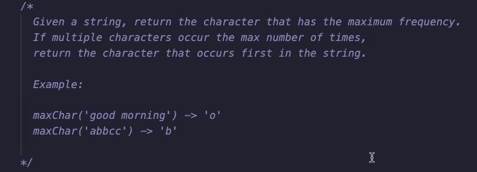

# Auxiliary Objects

- [Auxiliary Objects](#auxiliary-objects)
  - [Remove Dupe](#remove-dupe)
    - [Naive approach without using auxiliary object](#naive-approach-without-using-auxiliary-object)
    - [Approach while using auxiliary object](#approach-while-using-auxiliary-object)
    - [Method 3:](#method-3)
  - [Union](#union)
    - [Using Set](#using-set)
  - [MaxChar](#maxchar)
    - [using Map](#using-map)
  - [Two Sum](#two-sum)
    - [Naive approach - O(n^2):](#naive-approach---on2)
    - [Using Set - O(n)](#using-set---on)
  - [Nth Fibonacci](#nth-fibonacci)
    - [Naive (O(2^n))](#naive-o2n)
    - [Using auxiliary object (linear):](#using-auxiliary-object-linear)


## Remove Dupe

 ### Naive approach without using auxiliary object

```js
function removeDup1(arr) {
  const output = [];

  for (let element of arr) {
    if (!output.includes(element)) {
      output.push(element);
    }
  }

  return output;
}

// NOTE:
  // .includes method involves an iteration of an array with O(n) time.
  // The above approach essentially has a nested loop within a loop, making it O(n^2)
```

### Approach while using auxiliary object


```js
function removeDup2(arr) {
  const output = [];

  const aux = new Set();

  for (let element of arr) {
    if (!aux.has(element)) {
      aux.add(element);
      output.push(element);
    }
  }
  return output;
}
```

### Method 3:

```js
function removeDup3(arr) {
  const aux = new Set();

  for (let element of arr) {
    aux.add(element);

    return [...add];
  }
}
```

## Union

Create an array of unique elements when given an array of arrays.

```js
function union1(...arrays) {
  const output = [];

  for (let array of arrays) { // iterate through the argument arrays
    for (let element of array) { // for each arg array, iterate through the elements
      if (!output.includes(element)) { //for each element, check if it exists in output
        output.push(element); // push in it if it doesnt exist
      }
    }
  }

  return output;
}
```

### Using Set

```js
function union2(...arrays){
  const unique = new Set(); // set of unique values

  for (let array of arrays) {
    for (let element of array) {
      unique.add(element); // .add method will not add duplicates
    }
  }
}
```

## MaxChar



```js
function maxChar1(str) {
  const countObj = {}; // empty object to store characters and occurrences

  for (let char of str) { // loop through characters of string
    if (countObj[char] === undefined) countObj[char] = 0; // if there is no key with character, instantiate to 0;
    countObj[char]++; // increment
  }

  //find max occuring character
  let maxCharCandidate;
  let maxFreq = 0;

  for (let [char, freq] of Object.entries(countObj)) {
    if (maxCharCandidate === undefined || freq > maxFreq) {
      maxCharCandidate = char;
      maxFreq = freq;
    }
  }

  return maxCharCandidate;
}
```

### using Map

```js
function maxChar2(str) {
  const charMap = new Map();

  for (let char of str) {
    if (!charMap.has(char)) charMap.set(char, 0);
    charMap.set(char, charMap.get(char) + 1);
  }

  let maxCharCandidate;
  let maxFreq = 0;

  for (let [char, freq] of charMap.entries()) {
    if (maxCharCandidate === undefined || freq > maxFreq) {
      maxCharCandidate = char;
      maxFreq = freq;
    }
  }
  return maxCharCandidate;
}
```

## Two Sum

### Naive approach - O(n^2):

Creating two for loops (nested) and adding to target.

### Using Set - O(n)

```js

function twoSum2(arr, target) {
  // set to store difference between target and element
  const diffs = new Set();

  for (let element of arr) { // iterate through array
    if (diffs.has(element)) return true; // if current elem exists in diffs
    else diffs.add(target-element); // otherwise add the complement to the diffs
  }

  // target not found
  return false;
}
```
## Nth Fibonacci

### Naive (O(2^n))

```js
function nthFibonacci(n) {
  if (n <= 1) return n;
  return nthFibonacci(n-1) + nthFibonacci(n-2);
}
```

### Using auxiliary object (linear):

```js
function auxFib(n, aux = {0: 0, 1: 1}{
  if (aux.hasOwnProperty(n)) return aux[n];
  return aux[n] = auxFib(n-1, aux) + auxFib(n-2, aux);
}
```