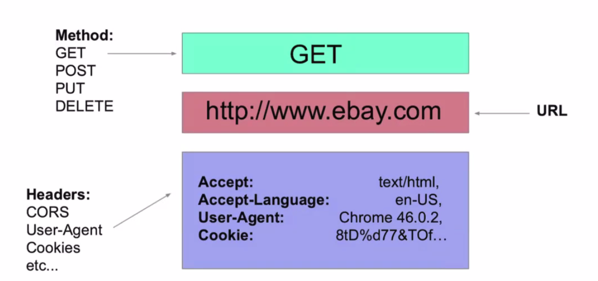
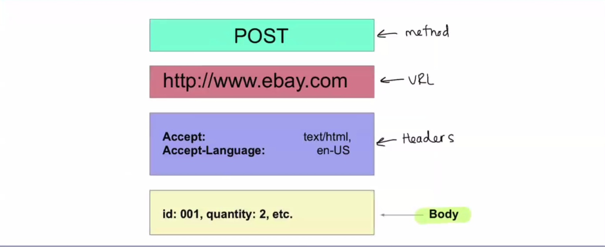
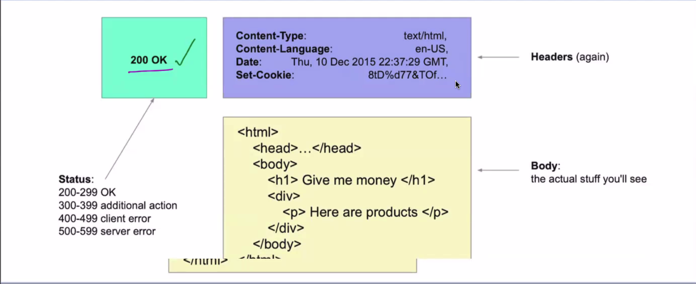
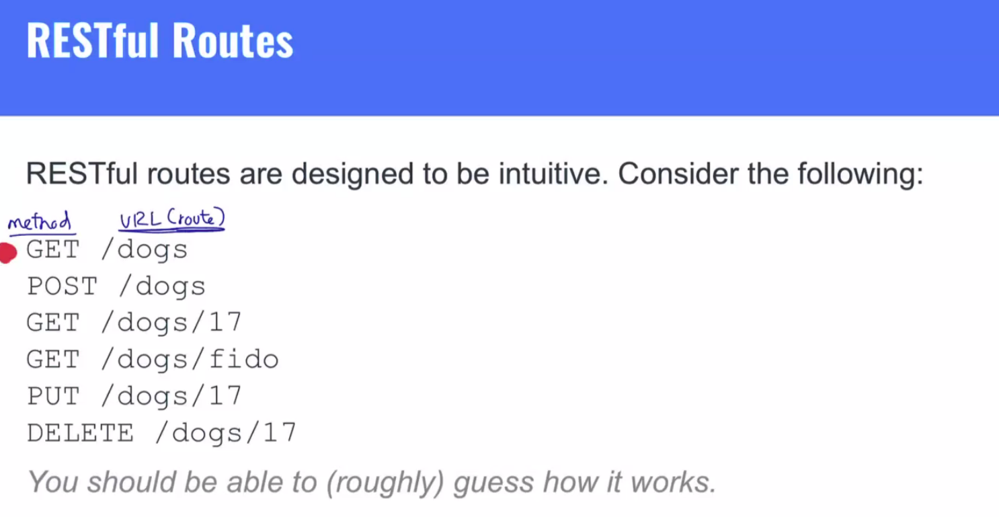
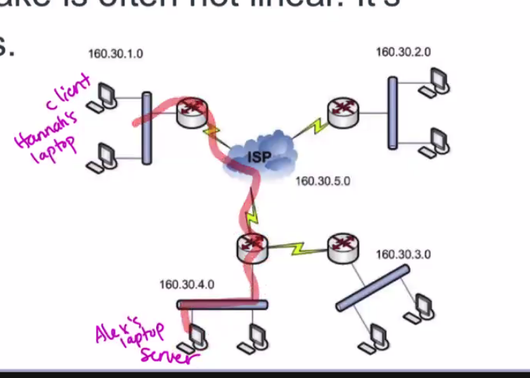
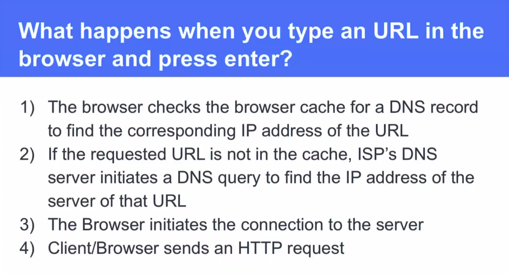
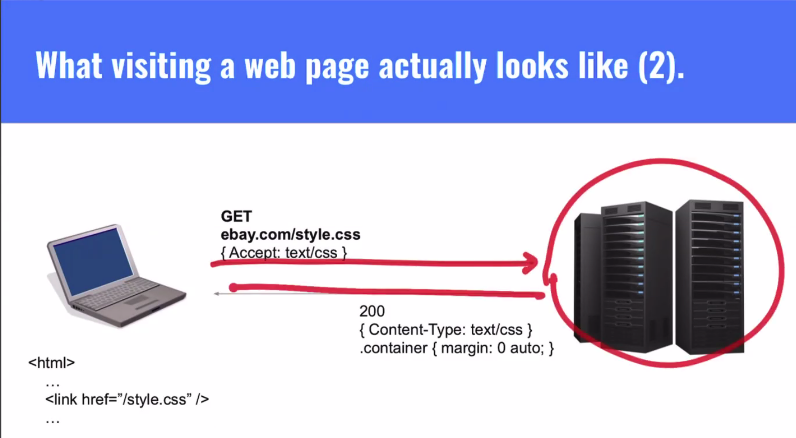
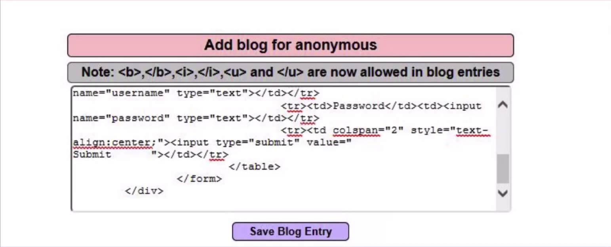
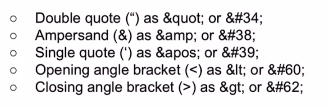

# Client-server - How to internet

- [Client-server - How to internet](#client-server---how-to-internet)
  - [What is full stack development?](#what-is-full-stack-development)
  - [Frontend](#frontend)
    - [What is a client?](#what-is-a-client)
    - [Frontend Content \& Layout](#frontend-content--layout)
    - [Frontend Logic](#frontend-logic)
  - [Backend](#backend)
    - [What is a server?](#what-is-a-server)
    - [What is a database?](#what-is-a-database)
    - [APIs/Web Services](#apisweb-services)
  - [HTTP - Hypertext Transfer Protocol](#http---hypertext-transfer-protocol)
    - [Request \& Response](#request--response)
    - [Parts of an HTTP response](#parts-of-an-http-response)
    - [The internet is just billions (if not trillions) of HTTP requests \& responses constantly being sent](#the-internet-is-just-billions-if-not-trillions-of-http-requests--responses-constantly-being-sent)
  - [Representational State Transfer (REST)](#representational-state-transfer-rest)
    - [REST is Stateless](#rest-is-stateless)
  - [Routers](#routers)
  - [IP Addresses](#ip-addresses)
  - [DNS](#dns)
  - [Aside: Vulnerabilities](#aside-vulnerabilities)
    - [Phishing attacks](#phishing-attacks)
    - [HTML Injection](#html-injection)
    - [Cross-Site Scripting (XSS)](#cross-site-scripting-xss)
  - [Never trust client-side input](#never-trust-client-side-input)

## What is full stack development?

A developer that is responsible for both client-side and server-side tasks, delivering end-to-end solutions.

Full stack devs work with frontend UX design, backend server logic, databases, and web services.

## Frontend

In general, anything that deals with the UI of the app.

### What is a client?

A client is any computer that can send an HTTP request.

Usually a web browser, however it could be the command line or any desktop/mobile app that connects to the network.

### Frontend Content & Layout

HTML & CSS

### Frontend Logic

Handled by Javascript, adds interactivity. 

## Backend

Anything that happens remotely on your services, or elsewhere on the cloud, is considered to be backend development.

### What is a server?

A server is any computer that can accept and respond to an HTTP request. 

- They deliver content
- Connect to databases
- Web APIs
- Provide central business logic

### What is a database?

Commonly located on another remote computer. 

**What does a database do?** 
The database stores data and state of the app. (Usually, the server handles business logic, while state and other data is stored on the database.)

### APIs/Web Services

Your application can connect to other applications on the web using web APIs (application programming interface).

Exist on external servers.
- Facebook
- Twitter
- Amazon
- Google (like images)  

## HTTP - Hypertext Transfer Protocol

Information is transferred using the protocol.
- An application-later protocol for transmitting documents such as HTML.
- Designed for communication between web browsers and web servers.
- Client initiates the conversation (request) and the server replies (response)/

### Request & Response

The HTTP request method is used to choose how to route the request.

- GET - retrieve some data
- POST - give data to the server
- PUT - update entire entry
- PATCH - update a piece of an entry
- DELETE - delete an entry

### Parts of an HTTP response
  
  

### The internet is just billions (if not trillions) of HTTP requests & responses constantly being sent

## Representational State Transfer (REST) 

REST is a way to structure your application and API

1. REST has **Intuitive Routing** (routes that make sense to the client).
2. REST is **stateless** - client state is not stored on the server.
3. REST **allows for performance tuning**.

### REST is Stateless

**Visible:** Every request contains all context necessary to understand it. Therefore looking at a single request is sufficient to visualize the interaction. 

**Reliable:** Since a request stands on its own, failure of one request does not influence others.

**Scalable:** The server does not have to remember the application state, enabling it to serve more requests in a shorter amount of time.

## Routers

The path that HTTP requests take is often not linear. It's routed through many directions.

## IP Addresses 

[...]

## DNS

In order to convert IP addresses into humanly readable domain names, we need something called the **Domain Name System** (DNS)

## Aside: Vulnerabilities

### Phishing attacks

An attacker impersonates a website in order to gain access to its users' sensitive information. Certain vulnerabilities in websites make them easy targets for this type of impersonation.

**Open redirects** exploit a websites redirect functionality.

### HTML Injection

**Never let users inject HTML**

### Cross-Site Scripting (XSS)

[...]

## Never trust client-side input

**Sanitize** all client-submitted data (from a request body, URL parameters, etc) prior to usage. This can be accomplished by encoding specific characters so that any code would be unable to run.

