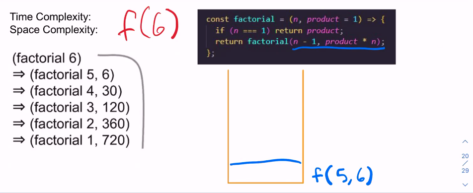
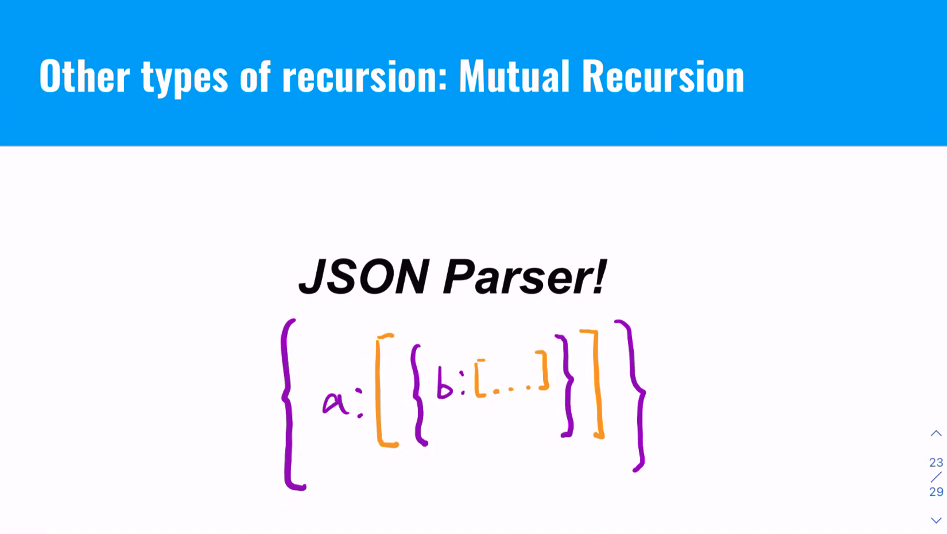
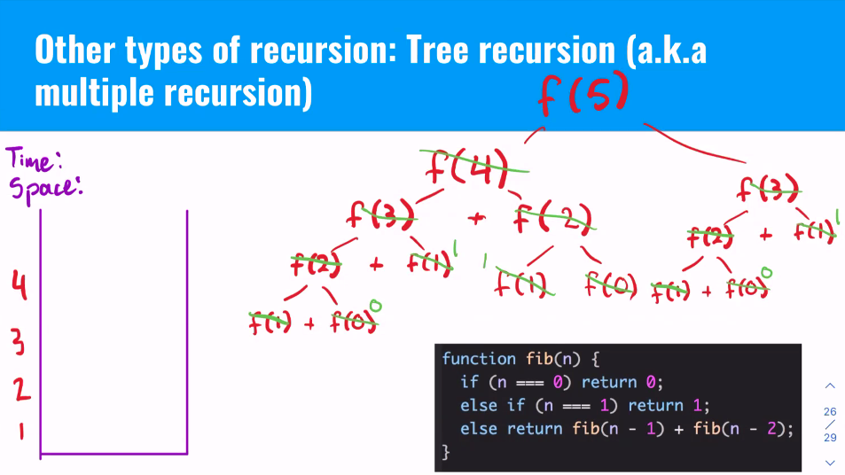

# Recursion

- [Recursion](#recursion)
  - [Why use recursion?](#why-use-recursion)
    - [Imperative vs Declarative](#imperative-vs-declarative)
    - [How vs What](#how-vs-what)
  - [Recursive functions are frequently more readable, maintanable, and easier to understand.](#recursive-functions-are-frequently-more-readable-maintanable-and-easier-to-understand)
    - [Why?](#why)
    - [Factorial: Option 1](#factorial-option-1)
    - [Factorial: Option 2](#factorial-option-2)
    - [Factorial: Option #3](#factorial-option-3)
  - [Linear Recursion](#linear-recursion)
  - [Tail Call Recursion](#tail-call-recursion)
  - [Mutual Recursion](#mutual-recursion)
  - [Tree Recursion](#tree-recursion)


## Why use recursion?

### Imperative vs Declarative
### How vs What
  


## Recursive functions are frequently more readable, maintanable, and easier to understand.

### Why?

- Non recursive functions describe **how** to get to a solution
- Recursive solutions describe **what** the solution is
  

### Factorial: Option 1

```js
const factorial = n => {
  let product = 1;
  while (n) {
    product *= n;
    n -= 1;
  }
  return product;
}
```

### Factorial: Option 2
Linear Recursion
```js
const factorial = n => {
  if (n === 0) return 1;
  return n * factorial(n-1);
}
```

### Factorial: Option #3
Tail Optimized Recursion
```js
const factorial = (n, product = 1) => {
  if (n === 0) return product;
  return factorial (n - 1, product * n);
}
```


## Linear Recursion

[...]

## Tail Call Recursion



## Mutual Recursion




## Tree Recursion



