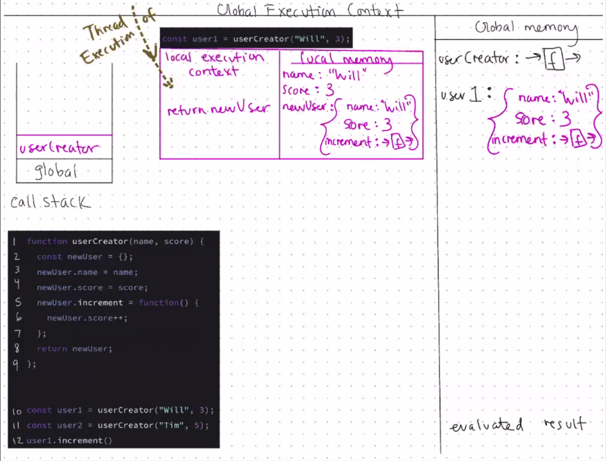
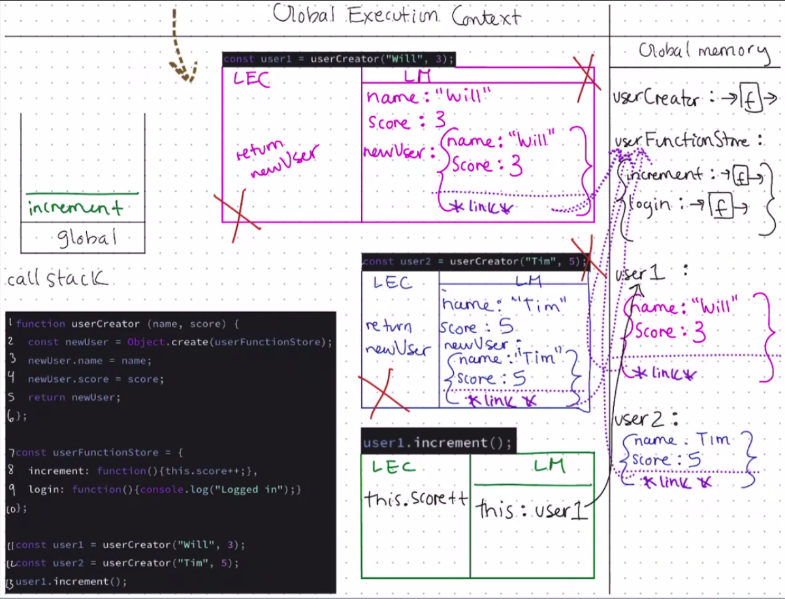
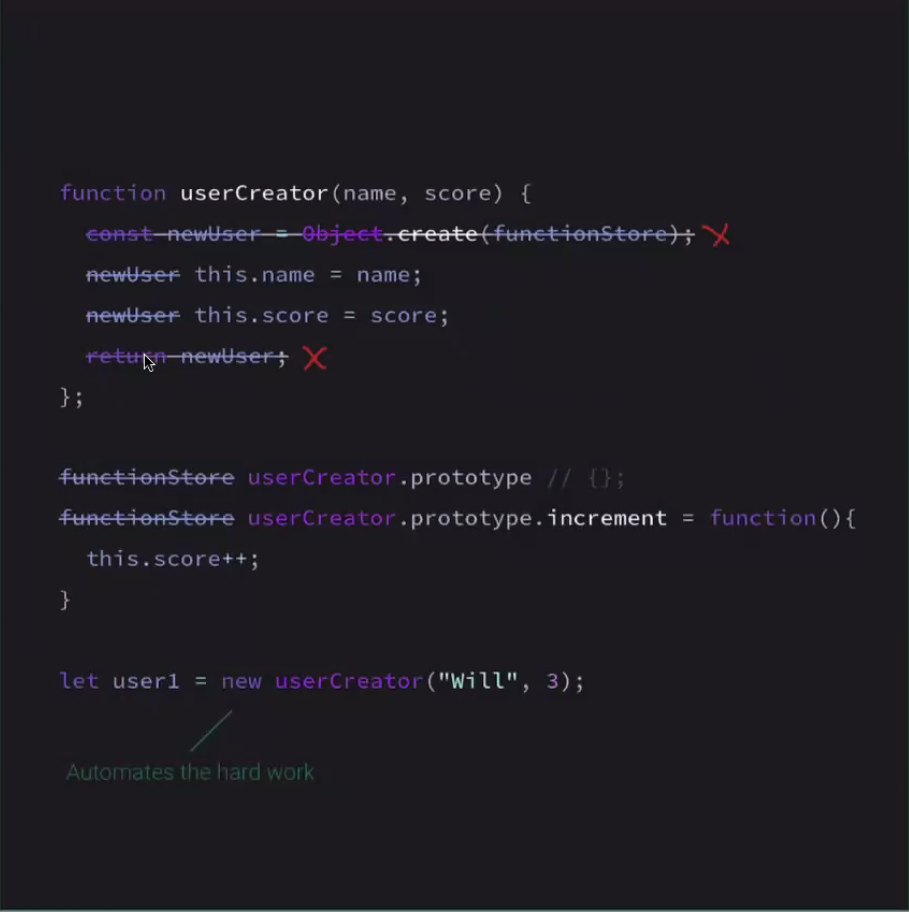
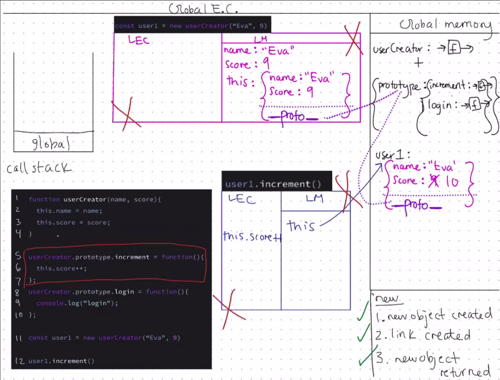

# Object-Oriented Programming

## Classes, Prototypes, & Object-Oriented Programming

### An enormously popular paradigm for structuring our complex code.

1. Easy to add features and functionality.
2. 
3. 

## Quiz Game

We will be storing user data using OOP.

### Objects - store functions with their associated data!

This is the principle of encapsulation. Let's keep creating our objects.

What alternative techniques do we have for creating objects?

```javascript
const user1 = {
  name: "Will",
  score: 3,
  increment: function() {
    user1.score++;
  }
};

user1.increment(); // user1.score => 4
```

### Creating user2 using dot notation

- Declare an empty object
- Add properties with dot notation

```javascript
const user2 = {}; // create an empty object

// assign properties to that object
user2.name = "Tim";
user2.score = 6;
user2.increment = function() {
  user2.score++;
};
```

### Creating user3 using Object.create

- Object.create is going to give us fine-grained control over our object later on.

Our code is getting repetitive, we're breaking our ***DRY principle*** (Don't Repeat Yourself - a core principle of Javascript).
And suppose we have millions of users! What could we do?

```javascript
const user3 = Object.create(null)

user3.name = "Eva";
user3.score = 9;
user3.increment = function() {
  user3.score++;
};
```

## Solution 1
### Generate objects using a function

```javascript
function userCreator(name, score) {
  const newUser = {};
  newUser.name = name;
  newUser.score = score;
  newUser.increment = function() {
    newUser.score++;
  }


  return newUser;
}

const user1 = userCreator("Will", 3);
const user2 = userCreator("Tim", 5);

user1.increment();

```



**Thread of Exectuion:** It's like reading a book with your finger.

**Benefits:** 
It's simple and easy to reason about!

**Problems:**

Each time we create a new user object, we make space in [...]


## Solution 2: Using the prototype chain

Store the ***increment*** function in just one object (***userFunctionStore***) and have the interpreter, if it doesn't find the function on user1, to look up that object and check if it exists there.

Link user1 and ***functionStore*** so that when the interpreter does not find the increment function directly on user1, it will next check ***userFunctionStore*** to see if the increment function exists there.

Make this link with Object.create() technique.

```javascript

function userCreator(name, score) {
  const newUser = Object.create(userFunctionStore);
  newUser.name = name;
  newUser.score = score;
  return newUser;
};

const userFunctionStore = {
  increment: function(){this.score++;}
  login: function(){console.log("Logged in");}
};

const user1 = userCreator("Will", 3);
const user2 = userCreator("Tim", 5)'
user1.increment();

```


### Problem

No major problems... but it's a little long-winded. 

We need to write these lines of code every single time we create a factory or function that returns an object...

```js
const newUser = Object.create(userFunctionStore);
...
return newUser;
```

Is there a way to avoid manually creating this new object and then returning it every time?

## The ***new*** keyword automates a lot of our manual work

When we call the constructor function with ***new*** keyword in front of it, we automate 2 things:

1. Create a new user object
2. Return the new user object

But now we need to adjust how we write the body of userCreator - how can we:

  - Refer to the auto-created object? ***this***
  - Store our single copies of function?



## Interlude - functions are both objects and functions

All functions have a default property on their object version, prototype, which is itself an object -

We can use this to replace our userFunctionStore object.

[Example]()

### Solution 3 completed using ***new*** keyword

New keyword:
1. New object created
2. Link created
3. New object returned out

```js
function userCreator(name, score){
  this.name = name;
  this.score = score;
}

userCreator.prototype.increment = function() {
  this.score++;
}

userCreator.prototype.login = function() {
  console.log("Login");
}

const user1 = new userCreator("Eva", 9);

user1.increment();
```



**Benefits**

- Faster to write (avoid manually creating and returning new object each time)
- Common practice in professional code


**Problems**

- 95% of developers has no idea how it works and therefore fail interviews.
- We have to uppercase the first letter of the function so we know it must be called with 'new' to work properly!


## Solution 4: The **class** 'syntactic sugar'

Classes are common in many other programming languages and were introduced to JS in 2015 (ES6)

Under the hood, this class solution works the same as solution 3.

*&&* keyword represents the object we create and return, and we can add properties (***name***, ***score***) to ***this*** in the ***constructor*** method.

We declare shared methods (***increment***, ***login***) outside of the ***constructor*** (these methods live on ***UserCreator.prototype***)

```js
class UserCreator {
  constructor(name, score) {
    this.name = name;
    this.score = score;
  }
  increment() {
    this.score++;
  }
  login(){
    console.log("login")
  }
}

const user1 = new UserCreator("Eva", 9);

user1.increment();
```

# Review

### Solution 1: 
Adding functionality on each user Object (violated our 3 golden rules of OOP)

### Solution 2: 
Create a global function Store (Bad practice to have global variables)

### Solution 3: 
Use the ***new*** keyword and the prototype chain

### Solution 4: 
es6 classes in Javascript
