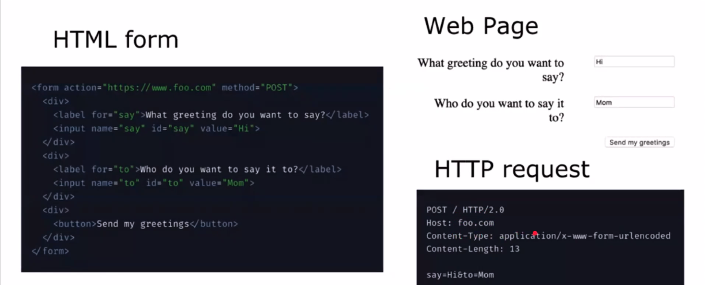
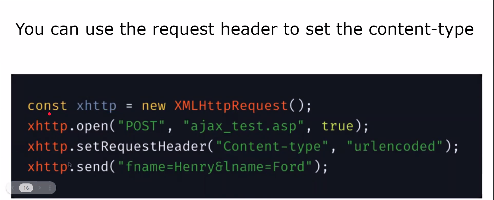
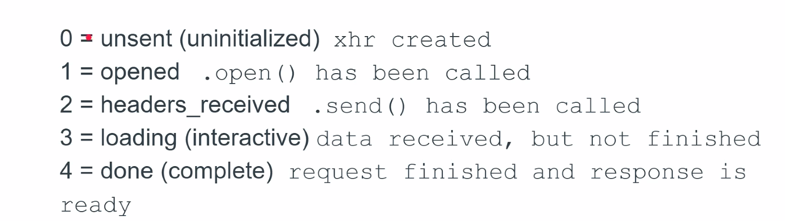
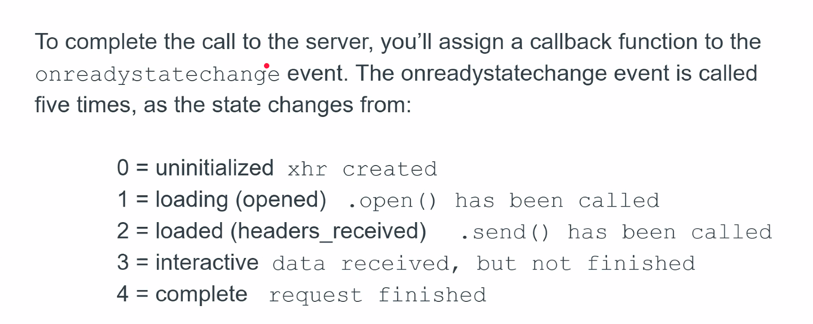

# Asynchronous Javascript

- [Asynchronous Javascript](#asynchronous-javascript)
  - [AJAX (Asynchronous Javascript and XML)](#ajax-asynchronous-javascript-and-xml)
    - [Why do we like it?](#why-do-we-like-it)
    - [POSTing data in a \< form \> without AJAX](#posting-data-in-a--form--without-ajax)
    - [Async vs Sync](#async-vs-sync)
    - [The problem with old HTTP](#the-problem-with-old-http)
    - [A solution with AJAX](#a-solution-with-ajax)
    - [Considerations with SPAs](#considerations-with-spas)
  - [How do we use AJAX?](#how-do-we-use-ajax)
    - [GET vs POST](#get-vs-post)
    - [Send a Request Header](#send-a-request-header)
  - [XHTTP](#xhttp)
    - [XMLHttpRequest - readyState](#xmlhttprequest---readystate)
    - [Handling the Response with a Callback](#handling-the-response-with-a-callback)
    - [XMLHttpRequest GET](#xmlhttprequest-get)
    - [XMLHttpRequest POST](#xmlhttprequest-post)
  - [JQuery](#jquery)
    - [GET](#get)
    - [AJAX](#ajax)
  - [fetch](#fetch)
    - [GET](#get-1)
    - [POST](#post)


## AJAX (Asynchronous Javascript and XML)
- Allows communication with servers from front-end code
- Originally designed to fetch XML
- Supports many data formats: JSON, HTML, text, etc
- Makes single page app (SPA) development possible

### Why do we like it? 
- Make non-blocking HTTP requests to a server
- Request data and receive data from a server after a page has loaded
- Send data to the server in the background
- Don't have to refresh the page to send data
- Don't have to tie POSTing data to a < form > tag

### POSTing data in a < form > without AJAX



### Async vs Sync

**Synchronous code** is completed before the next line of code is executed. Sync code is **blocking**.

**Asynchronous code** schedules work to be done later, once some work is complete elsewhere. Async code is **non-blocking.**

### The problem with old HTTP

- Old HTTP requests are blocking [...]

### A solution with AJAX
- AJAX uses Javascript to make HTTP requests to the server
- Javascript schedules code to execute once the request has been completed, allowing downstream code to execute
- Provides the basis for creating single page apps
  - Doesn't reload the page


### Considerations with SPAs

Start to think about how the normal UX changes when working in single page apps.

A few things that need to be addressed
- History
- Client state
- Visual feedback during initial load


## How do we use AJAX?

### GET vs POST

GET:
- Retrieve data


POST - allows client to send data
- Add data to database
- Send large amount of data
- Send user input

### Send a Request Header




## XHTTP

### XMLHttpRequest - readyState

- Each XHR client has a readyState property
  - Specifies current status of XHR



### Handling the Response with a Callback



The `onreadystatechange` event handler should do the following:
1. Check the readyState for the value 4 (complete)
2. Check the response status for the value 200 (status okay)
3. Work with the returned data supplied in responseText

### XMLHttpRequest GET

```js
const xhttp = new XMLHttpRequest();
xhttp.onreadystatechange = () => {
  if (xhttp.readyState === 4 && xhttp.status === 200) {
    document.getElementById('demo').innerHTML = xhttp.responseText;
  }
}

xhttp.open('GET', 'https://example.com/?sortBy=name', true);
xhttp.send();
```

### XMLHttpRequest POST

```js
// const xhttp = new XMLHttpRequest();
// xhttp.onreadystatechange = () => {
//   if (xhttp.readyState === 4 && xhttp.status === 200) {
//     document.getElementById('demo').innerHTML = xhttp.responseText;
//   }
// }

// xhttp.open('GET', 'https://example.com/?sortBy=name', true);

// OLD DATA - NEED TO REVIEW SLIDES AND UPDATE

xhttp.setRequestHeader('Content-type', 'application/json') // tell the server what to expect (expect to receive a JSON object)
xhttp.send(JSON.stringify({fname: Samantha, lname: Salley}));
```
[...]

## JQuery

### GET

*This can be a one-liner*
```js
$.get(
  'https://example.com/', // URL
  {}, // data to send
  (data, status, xhr) => {
    if (status === 'success') {
      $('#demo').innerHTML = data;
    }
  }, // callback function
  'text' //response data type
)
``` 

### AJAX

```js
$.ajax ({
  method: "POST",
  url: 'https://example.com/',
  data: JSON.stringify({fname: 'Samantha', lname: 'Salley'}), // stringify a JSON object and sending it off on the post request
  contentType: 'application/json', // type of content to expect
}) 
  .done((data) => ) [...] // THIS IS UNFINISHED - PLEASE REVIEW SLIDES AND ADD CODE 
  ```

## fetch

### GET

```js
const fetchData = fetch('https://example.com')
  .then((data) => data.json()) // converts data to json object
  .then((data) => { // THEN goes into this
    console.log(data);
  })
  .catch((err) => console.log(err))
```

### POST

```js
fetch ('https://example.com', {
  method: 'POST',
  body: JSON.stringify({fname: 'Sara', lname: 'Powers'}),
  headers: {
    'Content-Type': 'application/json',
  }
})
  .then(data => data.json())
  .then(data => {
    console.log(data)
  });
```