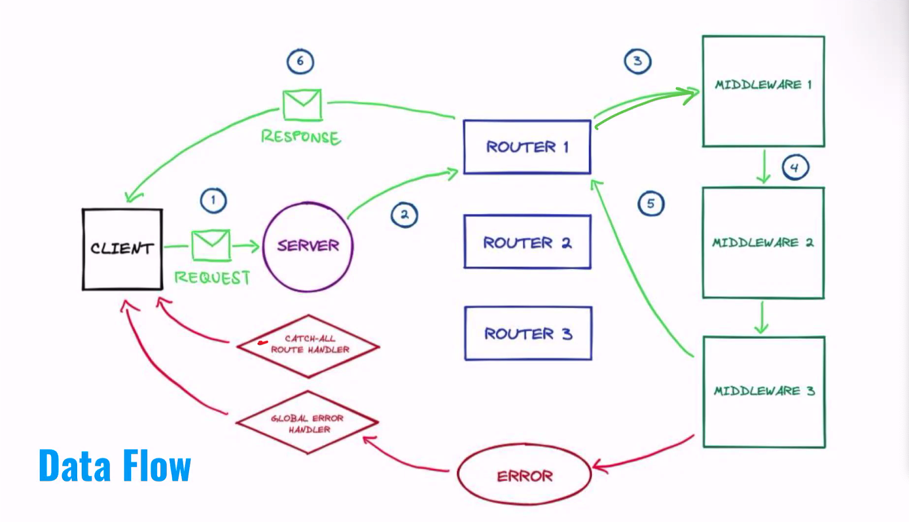
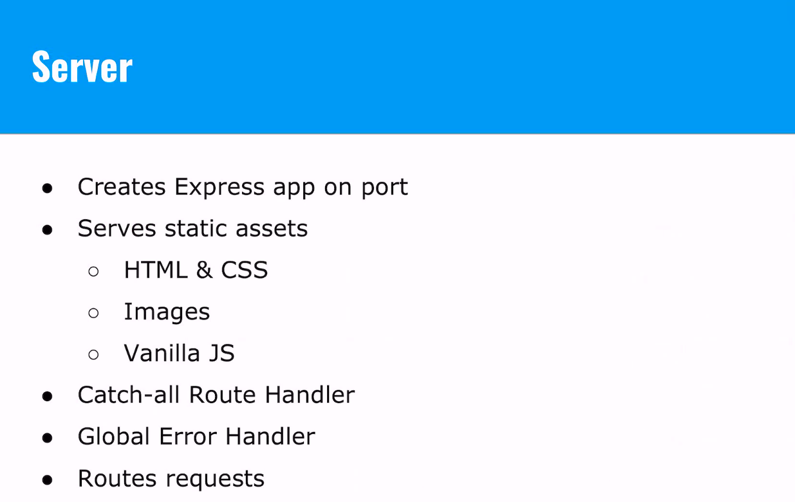
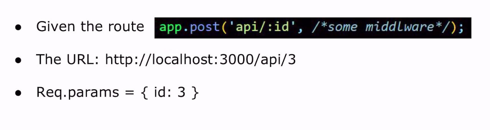
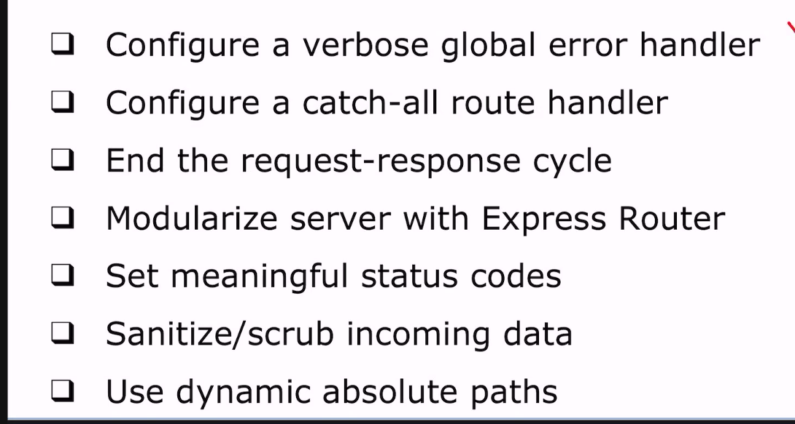
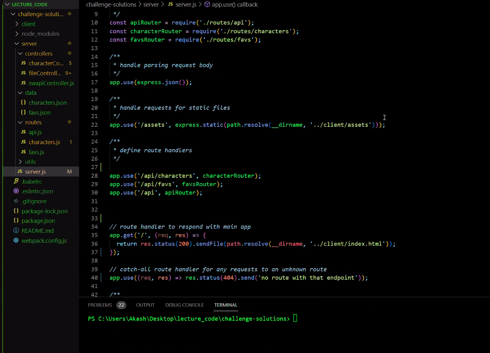
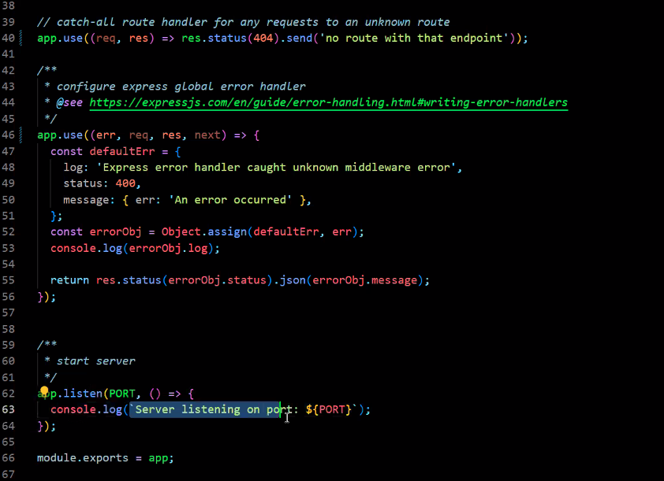
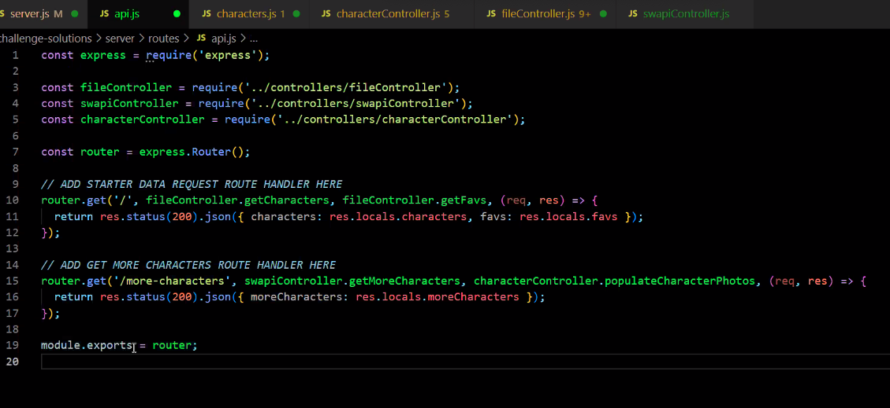
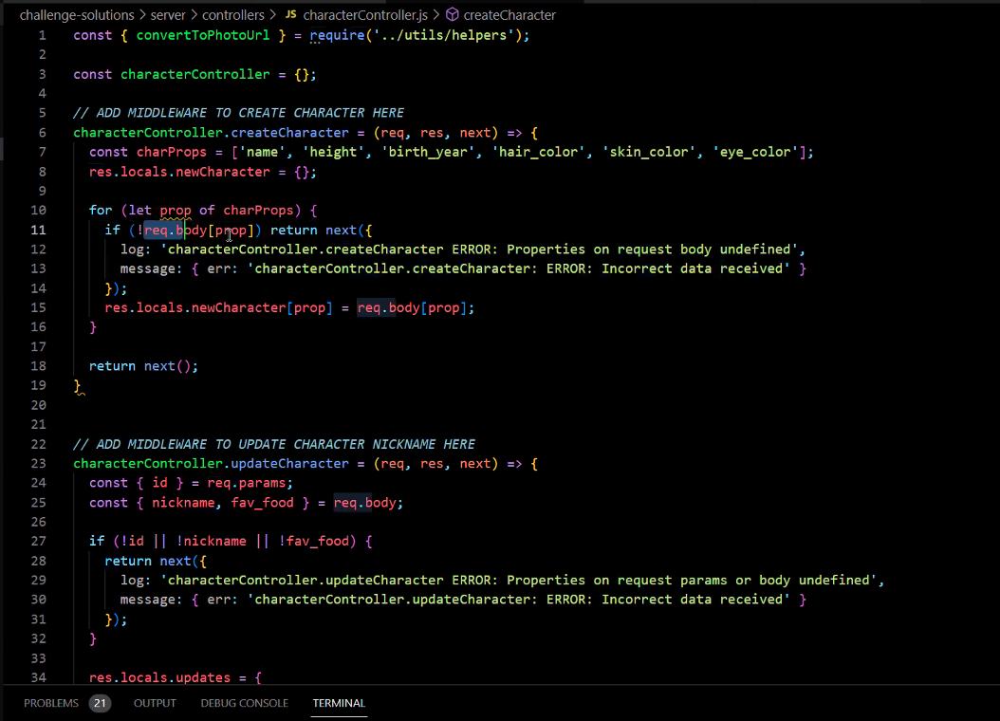
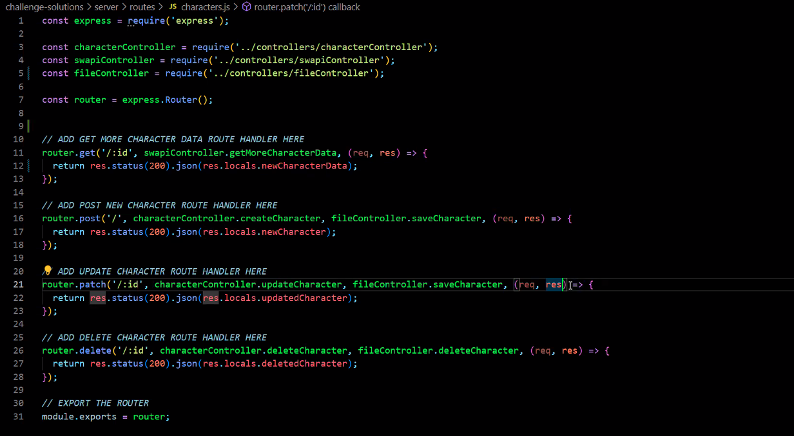

# Express

## Express Approach Lecture

### Data Flow

### Server

### Routes 
[...]

### Middleware
- Built in middleware:
  - express.static() - serves static files (HTML, CSS, images, vanilla JS)
  - express.json() - parses incoming request body from JSON to JS
  - express.urlencoded() - parses incoming request with url-encoded payloads, 'application/urlencoded' - mainly seen in form submissions
- Custom middlware

### Controllers

- Objects that hold custom middleware [...]
- Always return next()

### Route Parameters

### Best Engineering Practices

## Code Review

### server.js

### server.js pt 2

### api.js

### characterController.js

### characters.js

