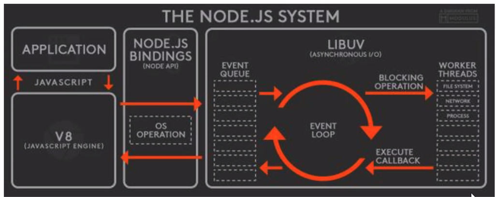
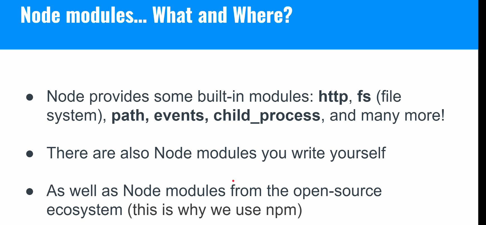
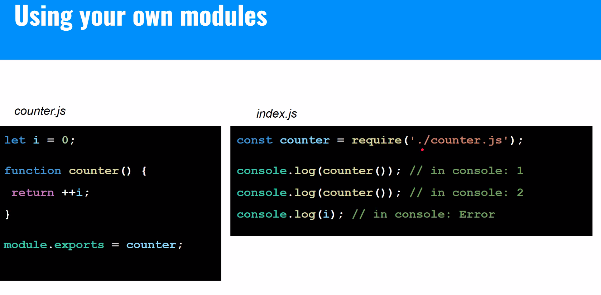
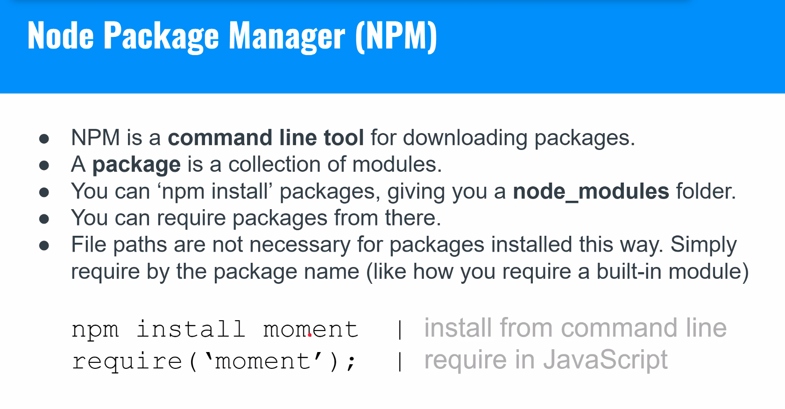
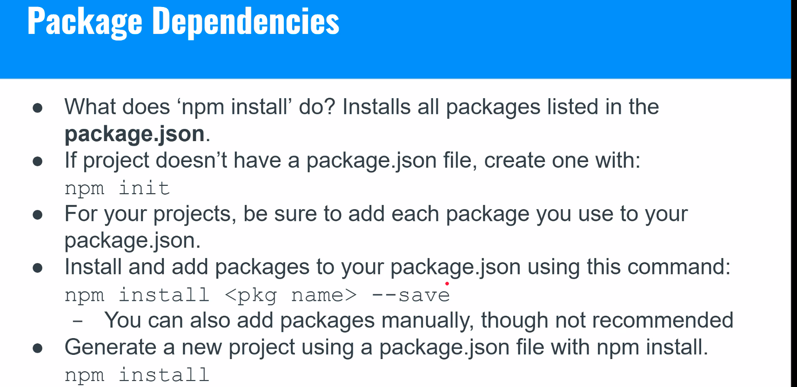
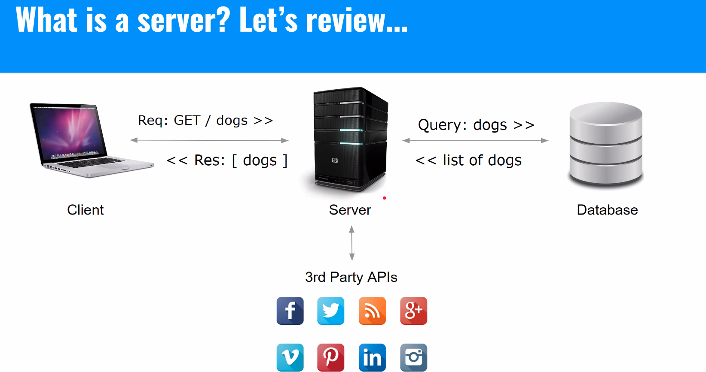
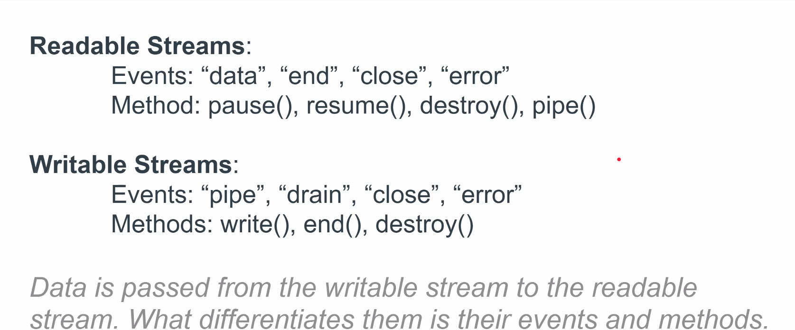
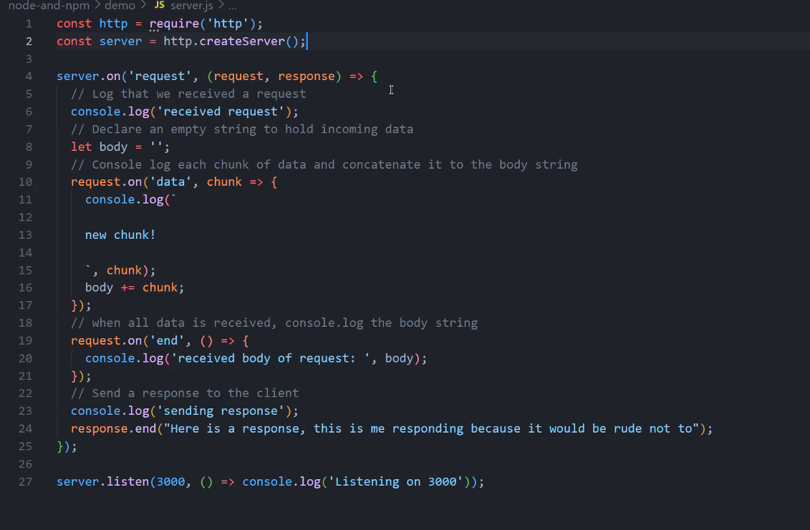

# Node

## What is a server? 

A server is just a piece of software that can take a request and sends a response back.

## What is Node? 

Node is an open-source cross-platform **runtime environment** for Javascript built by the Linux foundation.

Node is built on **V8**, the engine originally created for Chrome.

Node can do so much more than JS in the browser, such as make files, delete them, kill processes, shut down the computer, system calls, listen to a port, etc. **It is not sandboxed.**

### Why is Node.js a good idea?

- It's relatively high level
- Its the same language as the browser, reducing cognitive overhead
- It's **non-blocking**. Great for I/O bound applications
- NPM is awesome!

### Javascript in the browser

- JS Ecosystem is made up 
  - JS runtime
  - Event Loop
  - Queue(s)
- We can pass off time consuming/complex tasks to Web APIs to keep the JS thread from blocking for long periods of time
- The Web API pushes any delayed functionality onto the callback queue once the long/complex task completes
- The event loop is responsible for clearing the callback queue at the appropriate time
  
### Javascript in Node

- Node uses Chrome V8 engine for the JS runtime, but does NOT rely on it's event loop or callback queue.
- Instead, it uses the **libuv** library to handle the event loop, callback queue (event queue), and also for background I/O operations.




### How is Node different from JS in the browser?

- Node has NO Web API, no window, document, nav, etc.
- Node instead has its own system-related globals like _dirname _, _filename, and process.
- Node is still built on top of an event loop, and has functions/objects like setTimeout and console, but their underlying implementation is different.


## Node Modules & NPM

[...] check slides

### Why Modules?

- Enables Node to be lightweight and flexible

[...]

### What are modules? 

[...]

For example, if I want to build a web server, I might import Node's build in http module:

```js
const http = require('http');
```

### Node Modules - What and Where?



### Using your own modules



### Using your own modules - named exprots

```js

// counter.js

let i = 0;

function counter() {
  return ++1;
}

function countByTwo() {
  return i += 2;
}

module.exports = {counter, countByTwo};
```

```js
// index.js

const {counter, countByTwo} = require('./counter.js');

console.log(counter()); // in console: 1
console.log(counter()); // in console: 2
console.log(countByTwo()); // in console: 4
console.log(countByTwo()); // in console: 6
console.log(i); // in console: Error
```

## NPM - Node Package Manager



[...]
[...]

### Package Dependencies




## Node Server

### Why create a server?

- Fetch data from other services (fb,twitter)
- Save/fetch data from our own database
- Process large quantities/complex data outside the browser

### What is a server?



### How do servers work? 

- Servers listen for requests on a specified port
  - They can even listen for specific methods and/or requests to specific routes (endpoints)
- Depending on the method and route (endpoint) specified in the request, a server may or may not process the request in some way
- In the end, the server will *respond* to the request with a status (success/failure) and [optionally] some data


### An intro to Event Emitters

- A type of class which enables attaching specific funcionality to a particular event
- Think about events on the browswer, such as button click, and attaching a listener to that button with specific functionality to run

```js

// first example of a server

const EventEmitter = require('events');
const myEmitter = new EventEmitter();

myEmitter.on('action-occured', function() {
  console.log('I heard the action');
});

function action() {
  myEmitter.emit('action-occured');
}

action();
```

Node's **http** module, used for creating servers, is an example of an event emitter with a specific API.

```js

// first example of a server

const http = require('http');
const server = http.createServer();

server.on('request', (request, response) => {
  console.log('request received');
  let body = [];
  request.on('data', chunk => body.push(chunk));
  request.on('end', () => {
    body = Buffer.concat(body).toString();
    console.log(`Received body of request: ${body}`);
  });
});

server.listen('3000', () => {
  console.log('Listening on port 3000');
});
```

## Streams

### Types of streams



## Postman

Download Postman!!!

### What is Postman and why would I use it?

- A robust tool for testing your server 
- [...]


### Server example with pseudocode

