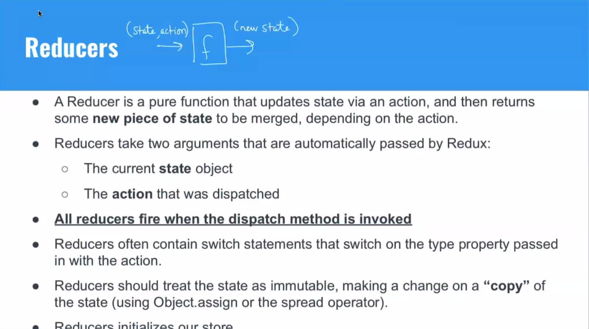

# Redux

- [Redux](#redux)
  - [Prop Drilling](#prop-drilling)
  - [State management library](#state-management-library)
  - [Observer Design Pattern](#observer-design-pattern)
  - [Under the hood](#under-the-hood)
  - [Flux](#flux)
  - [Flux Data Flow](#flux-data-flow)
  - [Redux Data Flow](#redux-data-flow)
  - [The Golden Rules of Redux](#the-golden-rules-of-redux)
    - [Stores](#stores)
    - [Actions](#actions)
    - [Reducers](#reducers)
  - [Actions, Reducers, Stores](#actions-reducers-stores)
    - [Action](#action)
    - [Reducers](#reducers-1)
    - [Stores](#stores-1)
  - [mapStateToProps](#mapstatetoprops)
  - [mapDispatchToProps](#mapdispatchtoprops)
  - [Action Creators \& Action Reducers](#action-creators--action-reducers)
  - [React Redux Architecture](#react-redux-architecture)


## Prop Drilling

Redux allows us to avoid prop drilling.


## State management library

- Simplified access to state across complex applications
- Better debugging - including time travel!
- Simplified testing
- A single source of truth

## Observer Design Pattern

- A software design pattern in which an object, called the **subject**, which references state, *publishes* its presence.
- It maintains a list of its dependents, called **observers** (or listeners), that have *subscribed* to notifications of any updates. When state changes, the subject notifies all subscribed observers, usually by calling one of their methods.
- The observer pattern is used primarily in **event-driven applications**. In front-end development, user actions are one prime example of the events that would drive the functionality of the application.


## Under the hood


## Flux

**Flux** is an implementation of the **Observer Pattern** that Facebook uses internally.
- Actions (object)
- Action Creator (function)
- Dispatcher (function)
- Stores (object) <- note that this is plural
- Views

## Flux Data Flow

1. An action occurs, which is created and passed by an action creator to the global dispatcher. 

[...]


Redux provides a stripped down version of flux architecture

## Redux Data Flow


[...]

## The Golden Rules of Redux

- Redux Store (single source of truth) - an object containing application state
- Actions - describe updates to state
- Action Creators - functions we call to dynamically create Actions
- Dispatch - sends action to all reducers
- Reducers - functions that apply updates to state

### Stores

[...]

### Actions

- Simple objects that contain data for our reducers to updates state. The **only way** to update state in the Redux store.
- Your component **dispatches** action objects whenever a state change needs to occur.
- Created via Action Creators
- Must contain a type that indicates the kind of update, thereby allowing the reducers to perform some work or not.

### Reducers




## Actions, Reducers, Stores

### Action
```js
dispatch({
  type: CHANGE_COUNT,
  payload: 5
})
```

### Reducers

```js
const initialState = {count: 0}

function countReducer(state = initialState, action) {
  switch(action.type) {
    case CHANGE_COUNT:
      return Object.assign({}, state, {count: action.payload})
    default:
      return state;
  }
}
```

### Stores

index.js
```js
import {combineReducers} from 'redux';
import countReducer from './countReducers.js';
import userReducer from './userReducer.js';

const reducers = combineReducers({
  count:countReducer,
  user:userReducer
})

export default reducers;
```

store.js
```js
import {createStore} from 'redux';
import reducers from './index.js';

const store = createStore(reducers);

export default store;
```

How do we make this available to the app?

1. Import **Provider** from react-redux, the store from store.js, and your top level component (app)
2. Wrap your top level component in the **Provider** component
3. Pass the store as a JSX attribute (like a prop) into the Provider wrap

```js
import {render} from 'react-dom'
import {Provider} from 'react-redux'
import App from './components/App'
import store from './store.js'

render(
  <Provider store = {store}>
    <App />
  </Provider>,
  document.querySelector('#root')
)
```


## mapStateToProps 

A pure function that recieves **state** as an argument and returns an objects listing any properties of state that the component wants to subscribe to.

Those keys will then be passed as props to the component they are connected to.

Box.jsx

```js
const mapStateToProps = state => (
  {
    counter: state.counter.count // gives these props to Box.jsx, this turns to 'this.props.counter'
    user: state.user
  }
)
```

## mapDispatchToProps

A pure function that receives **dispatch** as an argument and reutnrs an object containing event handlers.
- These event handlers can be passed to events (onClick, onChange, etc)
- When invoked, these event handlers will **dispatch actions**
- This is accomplished by invoking **action creators** that will return action objects, which are passed into dispatch

```js
const mapDispatchToProps = dispatch => (
  {
    increment: () => dispatch(incrementActionCreator()),
    decrement: () => dispatch(decrementActionCreator())
  }
)
```

Once these functions have been defined, they should be passed to the **connect** function that we import from react-redux. This ties our component to the redux store.

Box.jsx
```js
import {connect} from 'react-redux';

export default connect(mapStateToProps, mapDispatchToProps)(<Box />)
```


## Action Creators & Action Reducers


## React Redux Architecture

