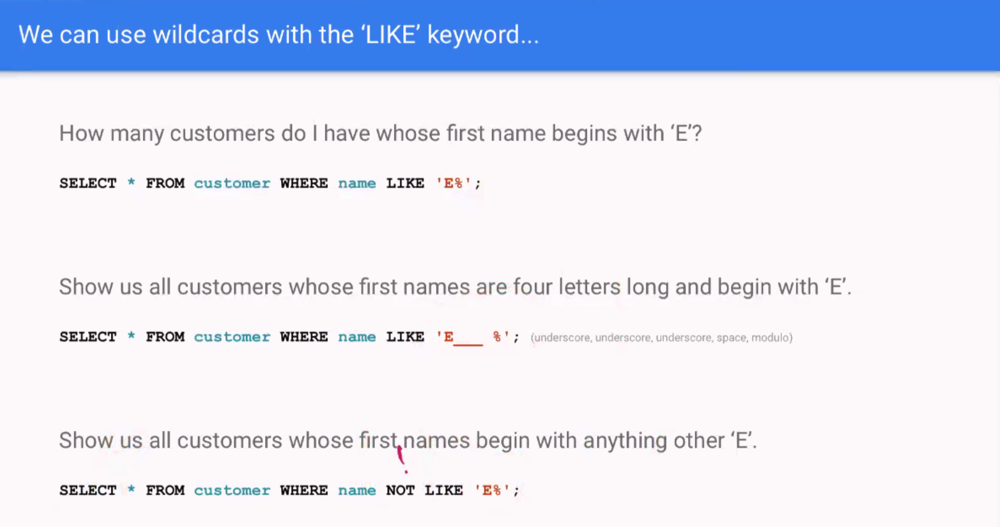
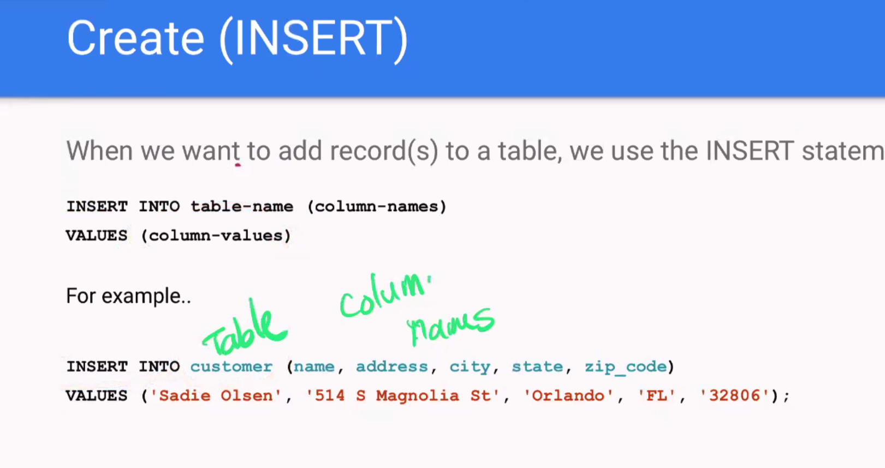
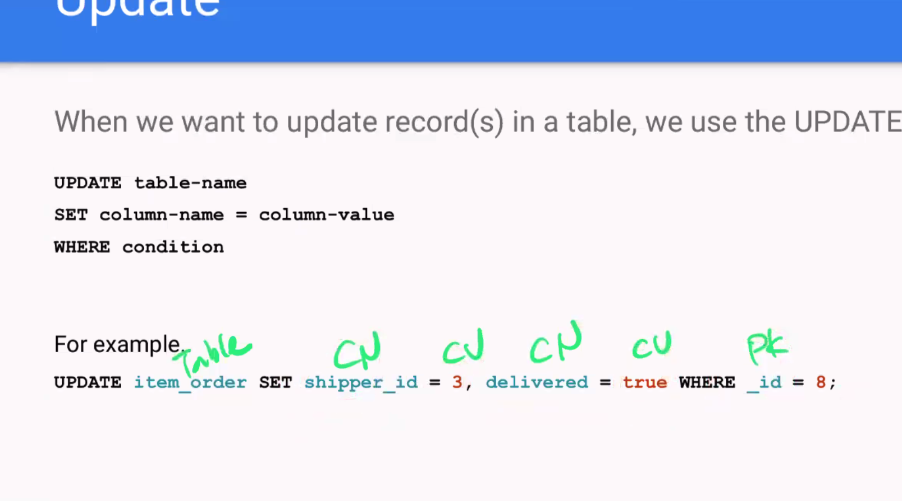
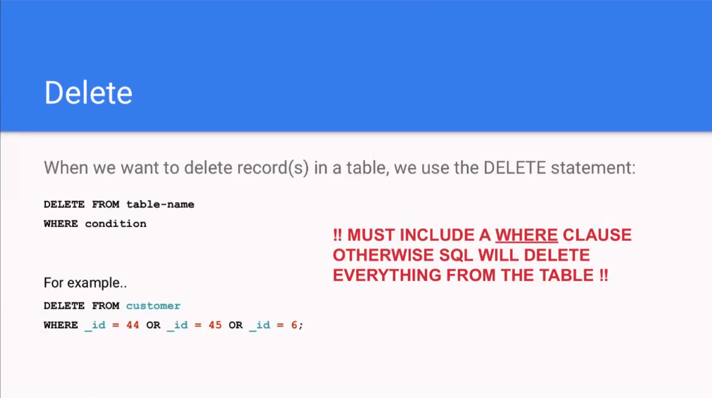
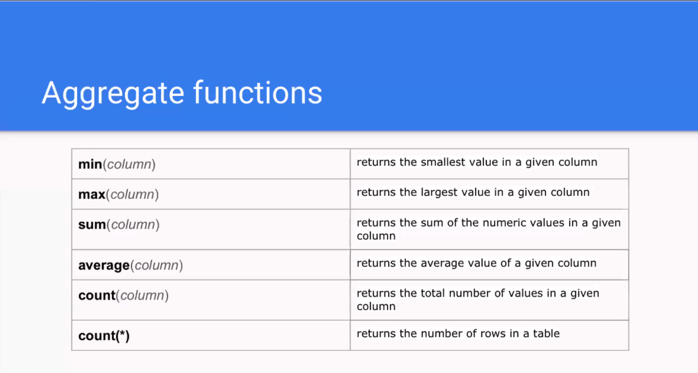

# Databases

[...] 

- Always use a ';' while querying (semicolon)

### We can use wildcards with the 'like' keyword

### CREATE (Insert)

When we want to add record(s) to a table, we use the INSERT statement

- columns do not need to be in order, but their matched VALUES need to be in the order of columns
  

### Read 

[...] refer to slides 

### Update

### Delete

### Aggregate functions

[...]
