# Data Modeling

- [Data Modeling](#data-modeling)
  - [How do I create a data model?](#how-do-i-create-a-data-model)
    - [Identify Entities](#identify-entities)
    - [Identify Relationships](#identify-relationships)
      - [Mapping relationships - Barker's Notation](#mapping-relationships---barkers-notation)
      - [Business constraints](#business-constraints)
      - [Cardinality](#cardinality)
    - [Identifying Attributes](#identifying-attributes)
      - [Identifying redundant data](#identifying-redundant-data)
      - [Derived Data](#derived-data)
    - [Assigning Keys](#assigning-keys)
      - [Foreign Keys](#foreign-keys)
    - [Normalization](#normalization)
      - [The First Form](#the-first-form)
      - [The Second Form](#the-second-form)
      - [The Third Form](#the-third-form)

## How do I create a data model?

1. Identify Entities
2. Identify Relationships
3. Identify Attributes
4. Assign Keys
5. Normalization
  

### Identify Entities

The types of info that is saved in our database is known as entities.

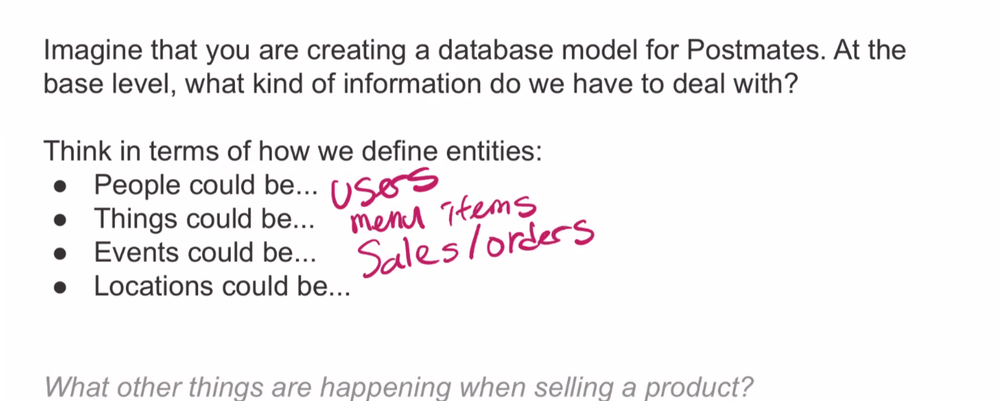

### Identify Relationships

#### Mapping relationships - Barker's Notation

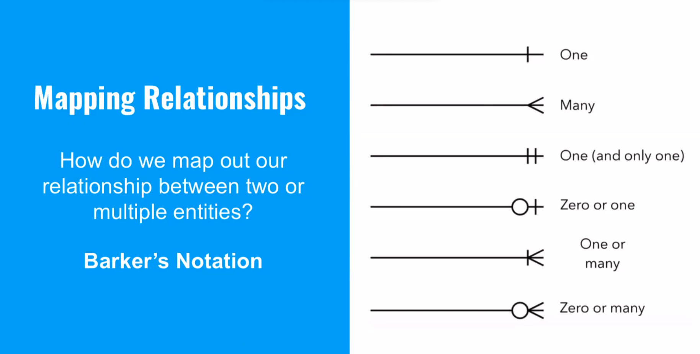

#### Business constraints

#### Cardinality

The **cardinality** shows how much of one side of the relationship belongs to how much of the other side of the relationship.

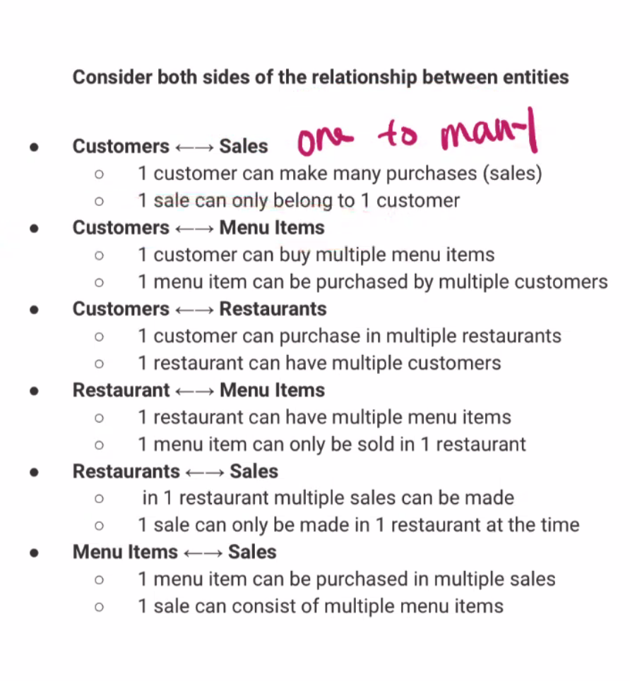

We can represent these relationships in an ER diagram.

We can look visually for any redundant relationships.

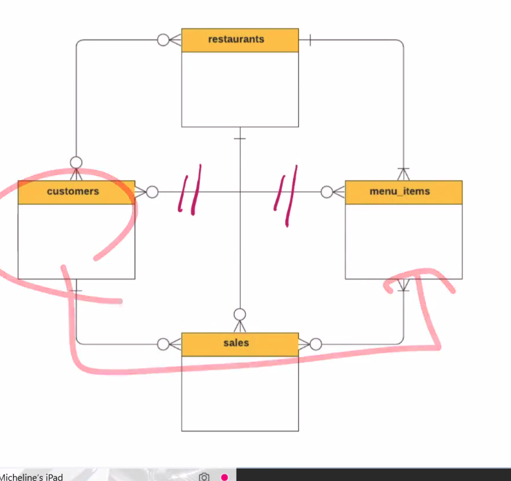

### Identifying Attributes

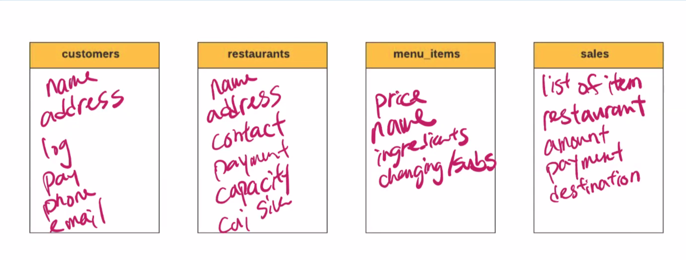

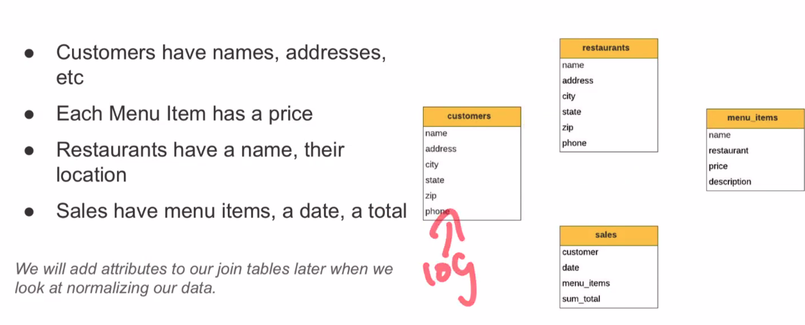

#### Identifying redundant data

[...]

#### Derived Data

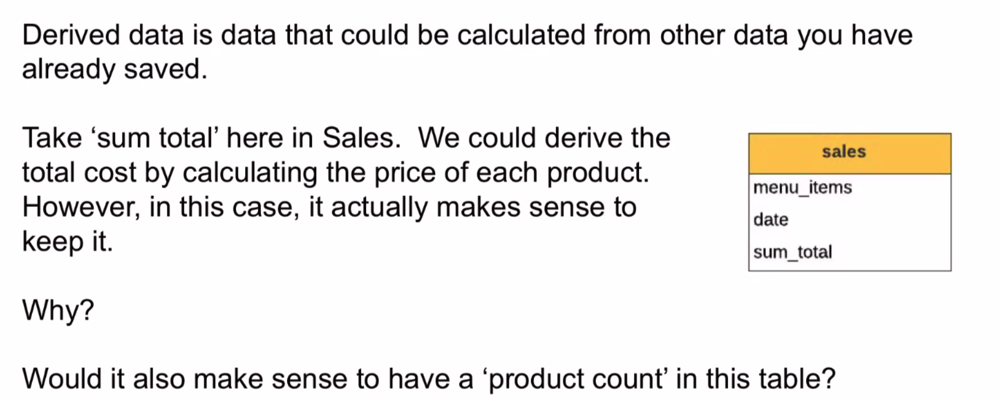

### Assigning Keys

[...]

#### Foreign Keys

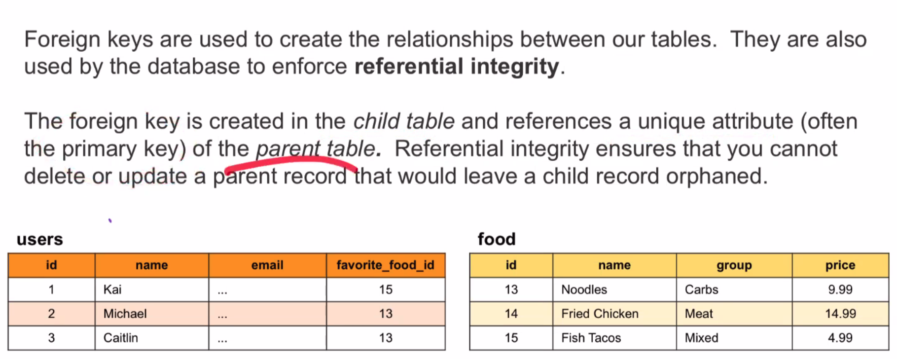

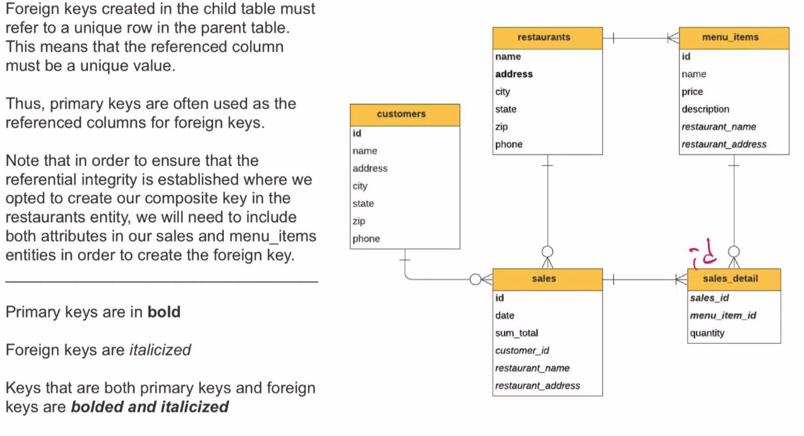

### Normalization

About making our model flexible and reliable

#### The First Form

The first form of normalization states that:

**There may be no repeating groups of columns in an entity**

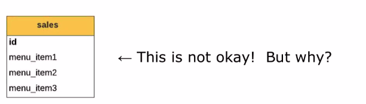

Anytime you wish you could use an array -- create a new table and establish a link via a one to many relationship. 

#### The Second Form

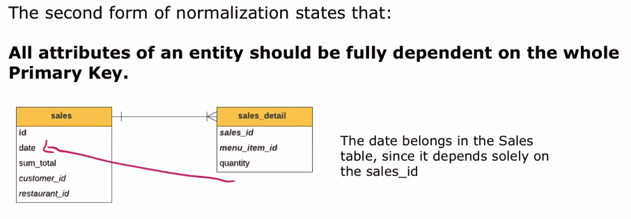

#### The Third Form

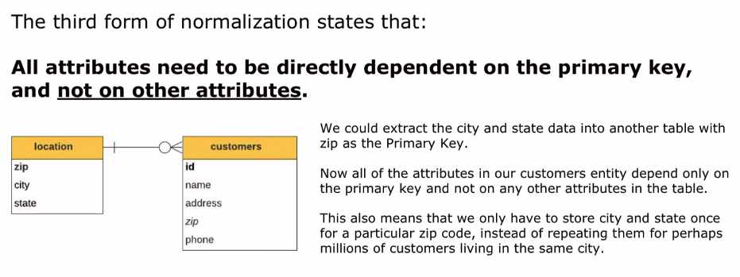

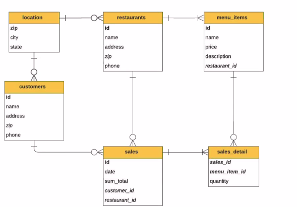