# MongoDB

- [MongoDB](#mongodb)
    - [MongoDB Document Store](#mongodb-document-store)
    - [Nesting](#nesting)
  - [Mongoose](#mongoose)
    - [Mongoose Library Features](#mongoose-library-features)
  - [CRUD in Mongoose](#crud-in-mongoose)
    - [Read](#read)
      - [Model.find vs Model.findOne](#modelfind-vs-modelfindone)
    - [Create](#create)
    - [Delete](#delete)
    - [Update](#update)
      - [Upsert](#upsert)
  - [Review](#review)
    - [MongoDB](#mongodb-1)
    - [Combining SQL and MongoDB for item catalogue](#combining-sql-and-mongodb-for-item-catalogue)
    - [Combining SQL and NoSQL](#combining-sql-and-nosql)
    - [Conclusion](#conclusion)


[...]


### MongoDB Document Store

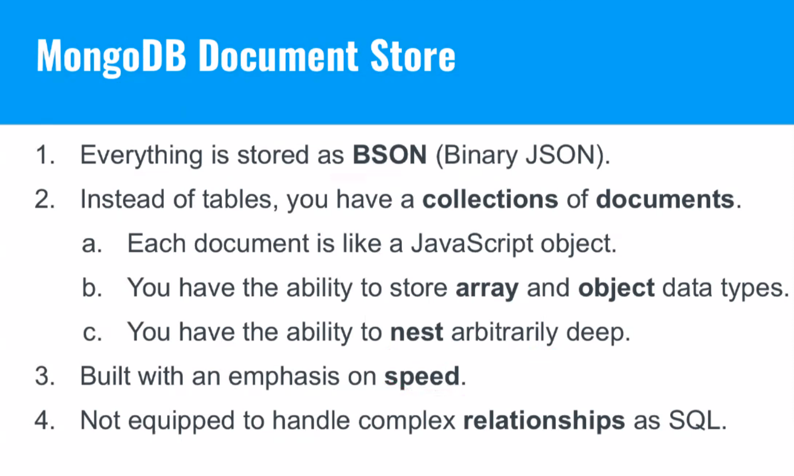

Built for speed

1. Ability to store an array of items: this is *embedding* and is an alternative to a foreign-key relationship
2. Flexibility in field properties and nesting, just like JSON. Great for unstructured/nested data

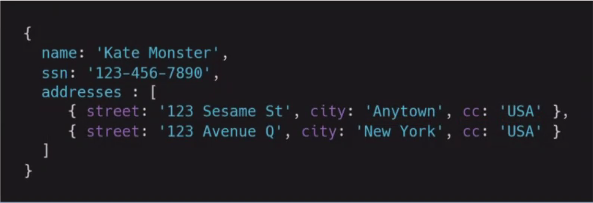

### Nesting

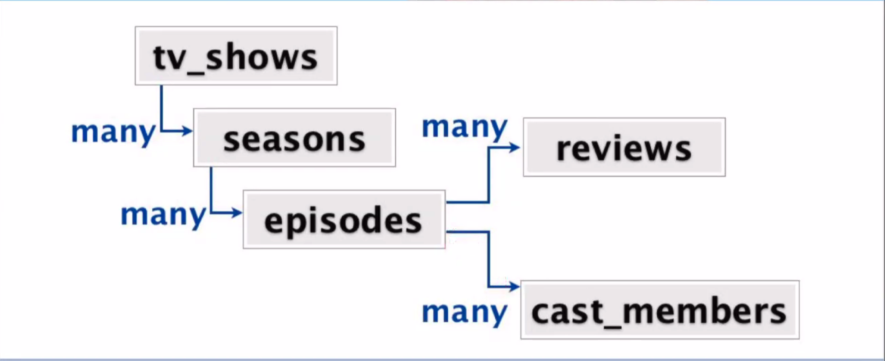

## Mongoose

Mongoose is the interface for MongoDB

### Mongoose Library Features


```js
const mongoose = require('mongoose');

const personSchema = new mongoose.Schema({
  name: {type: String, required: true},
  age: Number,
  quote: String,
  data: Mixed
});

const Person = mongoose.model('Person', personSchema);
```

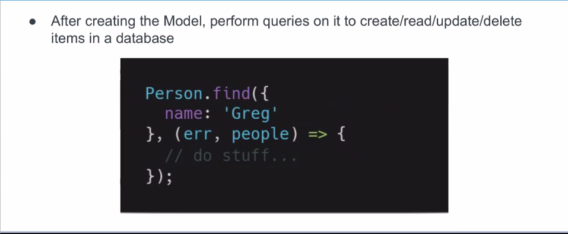


## CRUD in Mongoose

### Read

- Find an array of items matching the conditions object

```js
// callback style
Model.find(conditions, [projection], [options], callback);

// promise style
Model.find(conditions, [projection], [options]) . then(...);
```


#### Model.find vs Model.findOne

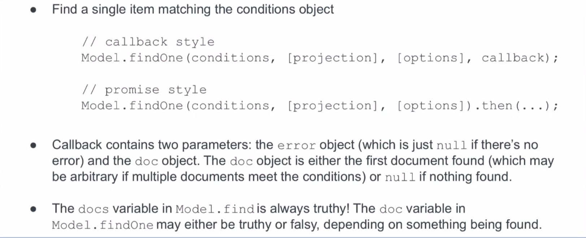

### Create

**Two syntax options:**

Model.prototype.save 

*and*

Model.create (use this)


You can use Model.create on an array of objects

### Delete


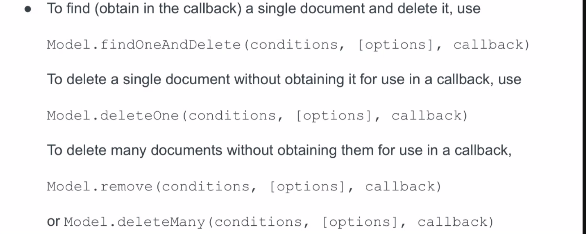


### Update

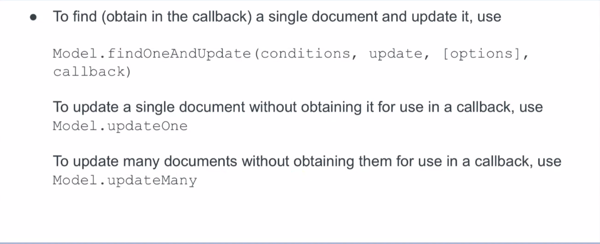

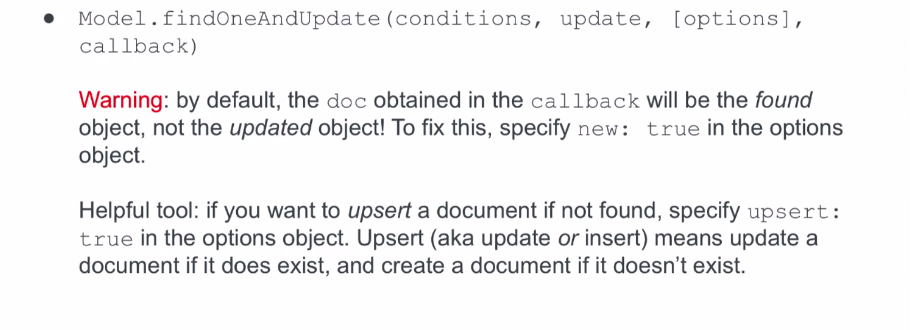

#### Upsert

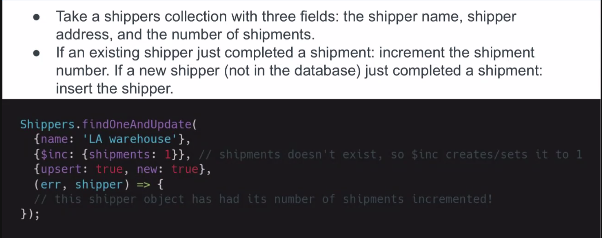


## Review

### MongoDB

- SQL' strength is guaranteed referential integrity, which is critical for datasets. You don't want to run a complex application logic to fix consistency issues.
- MongoDB's perforance can be used for certain parts of an application, but is unwieldy as a main database for highly relational information.
- That being said, there are real life cases for MongoDB [...] (refer to slides)

### Combining SQL and MongoDB for item catalogue

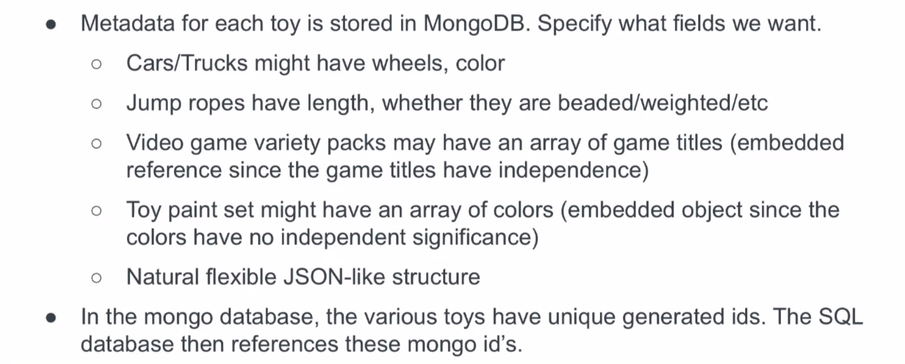

- Talk about this in interviews!

### Combining SQL and NoSQL

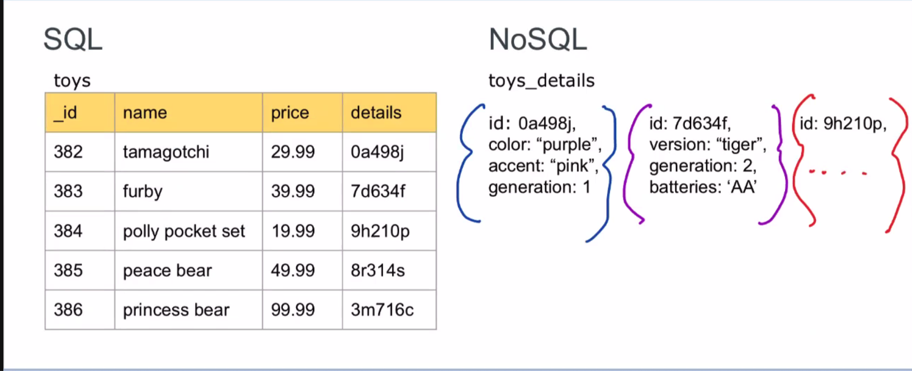


### Conclusion

- SQL is the go-to for maintaining relational data and should be used as a main database. It is the industry standard.
- MongoDB (document store) is good as a supplement for specialized data:
  - Catalogues with semi-flexible schema
  - Data with a natural JSON-like representation
  - Easy to embed/nest for read-heavy and not heavily relational situations
- Primarily interact with MongoDB through the Mongoose library

