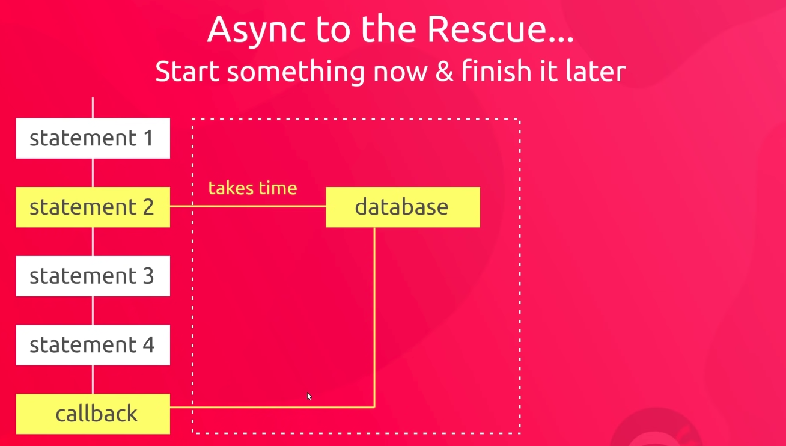

# Async Javascript

# Asynchronicity is the backbone of modern web development in Javascript

Javascript is single threaded (one command executing at a time) and has a synchronous execution model (each line is executed in the order the code appears).

So what if we need to **wait some time before we can execute certain bits of code?** Perhabs we need to wait on fresh data from an API/server request or for a timer to complete then execute our code.

We have a conundrum - a tension between wanting to **delay some code execution but not wanting to block the thread** from any further code running while we wait.

Instead of having a function block code from running (say, fetching from an API) - we pass it in as a callback to another function that acts asynchronously, allowing other code to run (oft using setTimeout, etc).




**PPT Notes**

What if we have a task:

- Accessing Twitter's server to get new tweets that takes a long time
- Code we want to run using those tweets

**Challenge:** We want to wait for the tweets to be stored in tweets so that they're there to run displayTweets on - but no code can run in the meantime.

**Slow Function blocks further code running.**

```
const tweets = getTweets('http://twitter.com/will.1')
// 350 ms wait while a request is sent to Twitter HQ

displayTweets(tweets)

// more code to run
console.log('I want to run!')
```

# What if we try to delay a function directly using setTimeout?

setTimeout is a built in function - its first argument is the function to delay, followed by how many ms to delay by.

```
function printHello(){
  console.log('Hello');
}

setTimeout(printHello, 1000);
console.log('Me first!');

// In what order will our logs appear?

```

**Javascript is not enough. We need new pieces (some of which aren't Javascript at all).**

Our core Javascript engine has 3 main parts:

- Thread of execution
- Memory/variable environment
- Callstack

We need to add some new components:

- Web Browser APIs/Node background APIs
- Promises
- Event loop, callback/task queue and micro task queue.

## ES5 solution: Introducing 'callback functions', and web browser APIs

We're interacting with a world outside of Javascript now, so we need rules.

```
function printHello(){console.log('Hello'); }

function blockFor1Sec(){
  // blocks in the Javascript thread for one second
};

setTimeout (printHello, 0);

blockFor1Sec()
console.log('Me first!')
```

## ES6+ solution - Promises

Using two-pronged 'facade' functions that both:

- Initiate background web browser work and
- Return a placeholder object (promise) immediately in Javascript

```
function display(data) {
  console.log(data)
}

const futureData = fetch('http://twitter.com/will.1')

futureData.then(display);

console.log('Me first!');
```

Special objects built into Javascript that get returned immediately when we make a call to a web browser API/feature (e.g. fetch) that's setup to return promises (not all are).

Promises act as a placeholder for the data we expect to get back from the web browser feature's background work.

## *then* method and functionality to call on completion

Any code we want to run on the returned data must also be saved on the promise object.

Added using .then method to the hidden property 'onFulfillment' 

Promise objects will automatically trigger the attached function to run (with its input being the returned data).

**But we need to know how our promise-deferred functionality gets back to Javascript to be run.**

```
function display(data){console.log(data)};
function printHello(){console.log('Hello')};

function blockFor300ms(){
  // blocks js thread for 300ms 
}

setTimeout(printHello, 0);

const futureData = fetch('http://twitter.com/will.1')
futureData.then(display);

blockFor300ms()
console.log('Me first!');
```